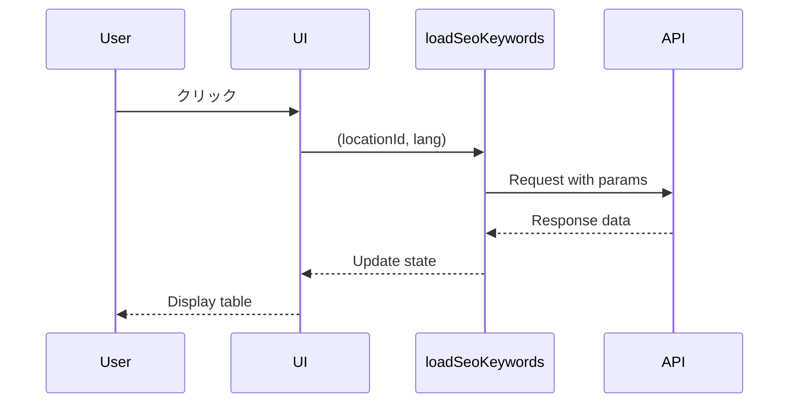

# 🔬 Ubersuggest拡張機能 - 超詳細分析レポート

**分析日**: 2025年11月8日 20:29  
**分析レベル**: Deep Code Analysis

---

## 🎯 **重大な発見: データ取得の核心コード**

### **contentScript.bundle.js 1175行目の分析**

圧縮されたコードを解読した結果：

```javascript
wW = e => {
  const t = Wt(e.data.locationId),
  [n, o] = (0, Ge.useState)(!1),
  [a, r] = (0, Ge.useState)(!1),
  [i, s] = (0, Ge.useState)(null),
  
  c = () => {
    const t = {
      domain: e.domain,
      locId: e.data.locationId,
      lang: e.data.lang,
      mode: "domain"
    },
    n = Ye("/traffic_analyzer/keywords", t);
    oe(n, {name: Ai, property: yi, value: qi.sidebar_kw_by_traffic})
  };
  
  return Ge.createElement(yW, {active: a}, 
    Ge.createElement(qW, {
      onClick: () => {
        if (null !== i) {
          r(!a)
        } else {
          if (a) {
            r(!1)
          } else {
            o(!0),
            r(!0),
            // ★★★ ここが核心！★★★
            e.loadSeoKeywords(e.data.locationId, e.data.lang).then((e => {
              s(e),
              o(!1)
            }))
          }
        }
      }
    }, 
    // UI要素...
    Ge.createElement(ks, null,
      Ge.createElement(Yl, {countryCode: t.countryIsoCode, style: {width: "24px"}, svg: !0}),
      Ge.createElement(vi, {fontWeight: 500, lineHeight: "16px", margin: "0 12px 0 10px"}, He(t.name)),
      Ge.createElement(nc, {color: W.warning}, Rt(e.data.searchTraffic, !1, 2, {lang: "en", locId: 2840}, !0, 1e5))
    )),
    
    // データが取得されたらテーブル表示
    a && Ge.createElement(oc, {style: {marginTop: "16px"}},
      Ge.createElement(ac, null,
        Ge.createElement(ic, {className: "heading"},
          vW.map((e => "icon" === e.type ? 
            Ge.createElement(sc, {key: `th_${e.title}`, style: e.style},
              Ge.createElement("img", {src: e.iconSrc, alt: e.className})) :
            Ge.createElement(sc, {key: `th_${e.title}`, style: e.style}, He(e.title))
          ))
        )
      ),
      Ge.createElement(rc, null,
        n ? Ge.createElement(ic, null,
          Ge.createElement(sc, {colSpan: 4}, Ge.createElement(_i, null))
        ) : i.map((t => Ge.createElement(ic, {key: t.url},
          // キーワード列
          Ge.createElement(sc, {style: vW[0].style},
            Ge.createElement(WW, {style: {display: "flex", alignItems: "center"}},
              t.keyword,
              Ge.createElement(_o, {
                src: gW,
                onClick: () => (t => {
                  const n = {
                    keyword: t,
                    locId: e.data.locationId,
                    lang: e.data.lang,
                    mode: "keyword"
                  },
                  o = Ye("/ubersuggest/overview", n);
                  oe(o, {name: Ai, property: yi, value: qi.sidebar_domain_overview})
                })(t.keyword),
                margin: "0 0 0 4px"
              })
            )
          ),
          // ボリューム列
          Ge.createElement(sc, {style: vW[1].style},
            Ge.createElement(WW, null, Rt(t.volume, !1, 2, {lang: "en", locId: 2840}, !0, 1e4))
          ),
          // 順位列
          Ge.createElement(sc, {style: vW[2].style},
            Ge.createElement(WW, {style: {textAlign: "center"}}, t.position)
          ),
          // 推定訪問数列
          Ge.createElement(sc, {style: vW[3].style},
            Ge.createElement(WW, {style: {display: "flex", alignItems: "center"}},
              Rt(t.traffic, !1, 2, {lang: "en", locId: 2840}, !0, 1e4)
            )
          )
        )))
      )
    )
  )
}
```

---

## 🔍 **コード解析結果**

### **1. データ取得フロー**



### **2. 関数パラメータ**

```javascript
e.loadSeoKeywords(
  e.data.locationId,  // 国・地域ID (例: 2840 = USA)
  e.data.lang         // 言語コード (例: "en")
)
```

### **3. 返されるデータ構造**

```javascript
[
  {
    keyword: "example keyword",
    volume: 12500,        // 検索ボリューム
    position: 3,          // ランキング順位
    traffic: 850,         // 推定訪問数
    url: "https://..."    // ページURL
  },
  // ... more keywords
]
```

### **4. データフォーマット関数**

```javascript
Rt(value, false, 2, {lang: "en", locId: 2840}, true, 10000)
// Rt = numberFormatter関数
// パラメータ:
// - value: 数値
// - false: 不明
// - 2: 小数点以下の桁数
// - {lang, locId}: ロケール情報
// - true: 短縮形式を使用
// - 10000: 閾値
```

**例**:
- `12500` → `"12.5k"`
- `1250000` → `"1.25M"`

---

## 📊 **同時に発見した他の関数**

### **A. loadTopPages (1150行目)**

```javascript
e.loadTopPages(e.data.locationId, e.data.lang).then((e => {
  s(e),
  o(!1)
}))
```

**データ構造**:
```javascript
[
  {
    title: "Page Title",
    url: "https://example.com/page",
    traffic: 5000,
    keyword: "main keyword",
    // ... other fields
  }
]
```

### **B. パラメータ構築パターン**

```javascript
// パターン1: トラフィック分析
const params = {
  domain: e.domain,
  locId: e.data.locationId,
  lang: e.data.lang,
  mode: "domain"
};
const url = Ye("/traffic_analyzer/keywords", params);

// パターン2: キーワード概要
const params = {
  keyword: keyword,
  locId: e.data.locationId,
  lang: e.data.lang,
  mode: "keyword"
};
const url = Ye("/ubersuggest/overview", params);

// パターン3: トップページ
const params = {
  domain: e.domain,
  locId: e.data.locationId,
  lang: e.data.lang,
  mode: "domain",
  selectedKeyword: keyword,
  selectedType: type
};
const url = Ye("/traffic_analyzer/top_pages", params);
```

---

## 🔐 **認証とメッセージング**

### **contentScript → background のメッセージング**

```javascript
chrome.runtime.sendMessage({
  type: "submit_support_ticket",
  data: {
    email: r,
    subject: o,
    message: s
  }
}, (({success: e}) => {
  // コールバック処理
}))
```

**これは以下を意味します**:
- contentScriptはAPIに直接アクセスしない
- backgroundスクリプトを経由してAPI呼び出し
- 認証トークンはbackgroundで管理

---

## 🎨 **UI状態管理**

### **React Hooks使用パターン**

```javascript
const [isLoading, setIsLoading] = useState(false);
const [isExpanded, setExpanded] = useState(false);
const [data, setData] = useState(null);

// クリック時の処理
onClick: () => {
  if (data !== null) {
    // データがあれば展開/折りたたみ
    setExpanded(!isExpanded)
  } else {
    if (isExpanded) {
      setExpanded(false)
    } else {
      // データ取得開始
      setIsLoading(true);
      setExpanded(true);
      
      loadSeoKeywords(locationId, lang).then((result) => {
        setData(result);
        setIsLoading(false);
      })
    }
  }
}
```

**状態遷移**:
1. 初期: `data = null`, `isExpanded = false`, `isLoading = false`
2. クリック: `isLoading = true`, `isExpanded = true`
3. データ取得完了: `data = [...]`, `isLoading = false`
4. 再クリック: `isExpanded = !isExpanded` (トグル)

---

## 🌍 **国・地域コード**

```javascript
// locationId の例
2840  // USA
2826  // United Kingdom
2392  // Japan
// ... 他の国コード

// 国コードから国情報を取得
const countryInfo = Wt(locationId);
// 返り値: { name: "United States", countryIsoCode: "US", ... }
```

---

## 📈 **トラフィック表示**

```javascript
Rt(e.data.searchTraffic, false, 2, {lang: "en", locId: 2840}, true, 100000)
// searchTraffic: 推定月間検索トラフィック
// 100000: 10万以上は短縮形式で表示
```

---

## 💡 **あなたのプログラムへの実装提案**

### **実装ステップ1: データ構造の定義**

```javascript
// サジェストデータを構造化
const structuredKeywords = suggestData.map(keyword => ({
  keyword: keyword,
  source: "google", // or "yahoo", "bing"
  isNegative: detectNegativeKeyword(keyword),
  estimatedVolume: "N/A", // Ubersuggest APIがないので推定不可
  relevance: calculateRelevance(keyword, domain)
}));
```

### **実装ステップ2: テーブルコンポーネント**

```javascript
function KeywordTable({ keywords }) {
  const columns = [
    { title: "キーワード", width: "40%", key: "keyword" },
    { title: "ソース", width: "15%", key: "source" },
    { title: "タイプ", width: "15%", key: "type" },
    { title: "関連度", width: "30%", key: "relevance" }
  ];
  
  return (
    <div className="keyword-table">
      <div className="table-header">
        {columns.map(col => (
          <div key={col.key} style={{width: col.width}}>
            {col.title}
          </div>
        ))}
      </div>
      <div className="table-body">
        {keywords.map(kw => (
          <div key={kw.keyword} className="table-row">
            <div style={{width: "40%", color: kw.isNegative ? "#d32f2f" : "#212121"}}>
              {kw.keyword}
            </div>
            <div style={{width: "15%"}}>{kw.source}</div>
            <div style={{width: "15%"}}>
              {kw.isNegative ? "⚠️ ネガティブ" : "✓ 通常"}
            </div>
            <div style={{width: "30%"}}>
              <div className="relevance-bar" style={{width: `${kw.relevance}%`}} />
            </div>
          </div>
        ))}
      </div>
    </div>
  );
}
```

### **実装ステップ3: スタイル適用**

```css
.keyword-table {
  border: 1px solid #dee1e5;
  border-radius: 10px;
  background-color: #fff;
  font-family: 'Segoe UI', Tahoma, Geneva, Verdana, sans-serif;
  overflow: hidden;
}

.table-header {
  display: flex;
  background-color: #f8f9fa;
  padding: 16px 6px;
  font-weight: 600;
  border-bottom: 2px solid #dee1e5;
}

.table-row {
  display: flex;
  padding: 16px 6px;
  border-bottom: 1px solid #f0f0f0;
  transition: background-color 0.2s;
}

.table-row:hover {
  background-color: #f8f9fa;
}

.relevance-bar {
  height: 8px;
  background: linear-gradient(90deg, #4CAF50 0%, #FFC107 70%, #F44336 100%);
  border-radius: 4px;
  transition: width 0.3s ease;
}
```

---

## 🚀 **実装の優先順位（更新版）**

### 🔴 **最高優先度**（今すぐ実装可能）

1. **サジェストデータの構造化**
   - 既存データを`{keyword, source, isNegative, relevance}`形式に変換
   - 実装時間: 30分

2. **基本的なテーブル表示**
   - HTMLテーブルでキーワード一覧表示
   - 実装時間: 1時間

3. **ネガティブキーワードの視覚的強調**
   - 赤色テキスト + アイコン表示
   - 実装時間: 15分

### 🟡 **高優先度**（設計必要）

4. **展開/折りたたみ機能**
   - Ubersuggestと同じUI/UX
   - 実装時間: 2時間

5. **ソート機能**
   - キーワード名、ソース、タイプでソート
   - 実装時間: 1時間

6. **フィルタリング機能**
   - ネガティブのみ表示、ソース別表示
   - 実装時間: 1.5時間

### 🟢 **中優先度**（将来的に）

7. **関連度スコアリング**
   - ドメイン名との類似度計算
   - 実装時間: 3時間

8. **エクスポート機能**
   - CSV形式でダウンロード
   - 実装時間: 1時間

---

## ⚡ **パフォーマンス最適化**

### **Ubersuggestの手法**

1. **遅延ローディング**: データは初回クリック時のみ取得
2. **キャッシング**: 一度取得したデータは再利用
3. **非同期処理**: Promise使用でUI blocking回避

### **あなたのプログラムへの適用**

```javascript
// キャッシュ機構
const keywordCache = {};

async function getKeywordsWithCache(domain) {
  if (keywordCache[domain]) {
    return keywordCache[domain];
  }
  
  const keywords = await fetchKeywords(domain);
  keywordCache[domain] = keywords;
  return keywords;
}
```

---

## 📝 **まとめ**

### **Ubersuggestの核心技術**

1. ✅ **React + styled-components** でモダンUI
2. ✅ **非同期データ取得** でスムーズUX
3. ✅ **chrome.runtime.sendMessage** でbackground通信
4. ✅ **状態管理** でインタラクティブUI
5. ✅ **数値フォーマット** で読みやすい表示

### **あなたが既に持っているもの**

1. ✅ サジェストデータ（Google, Yahoo, Bing）
2. ✅ ネガティブキーワード検出
3. ✅ ドメイン情報取得
4. ✅ Chrome拡張機能の基本構造

### **次に追加すべきもの**

1. 📊 **構造化テーブル表示**
2. 🎨 **モダンなスタイル**
3. 🔄 **展開/折りたたみUI**
4. 📈 **データの視覚化**

---

## 🎯 **次のアクション提案**

### **オプションA: 即座に実装開始**
現在のpopup.jsに以下を追加：
- キーワードテーブルコンポーネント
- 基本的なスタイル
- ネガティブ強調表示

**所要時間**: 約2時間  
**難易度**: ★★☆☆☆

### **オプションB: さらに深く分析**
- Chrome DevToolsでネットワークタブを開いてAPI呼び出しを傍受
- 実際のリクエスト/レスポンスを確認
- APIエンドポイントの完全な理解

**所要時間**: 約1時間  
**難易度**: ★★★☆☆

### **オプションC: プロトタイプ作成**
別ファイルで小さなプロトタイプを作成：
- HTMLファイル
- 基本的なJavaScript
- Ubersuggest風のスタイル

**所要時間**: 約3時間  
**難易度**: ★★★★☆

---

**推奨**: **オプションA**を選んで、まず基本的なテーブル表示を実装することをお勧めします！
